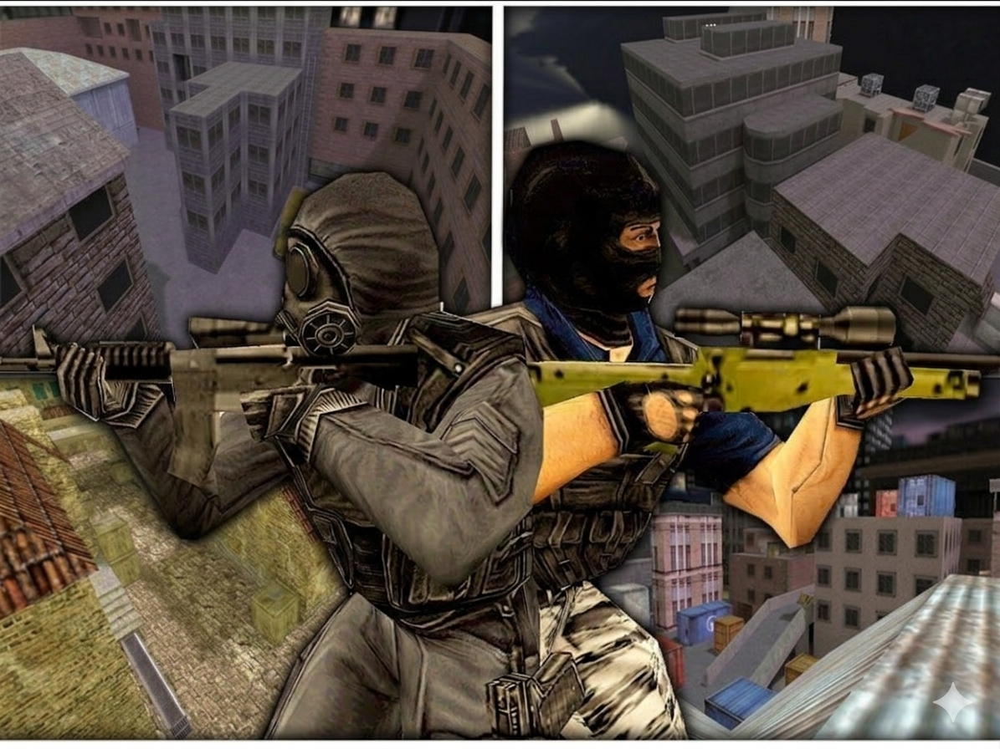

<div align="center">



<br>

# GTRHNS — Hide'n'Seek Match System

**CS 1.6 捉迷藏比赛管理系统 | 9 种游戏模式 | 20+ 配套插件**

**服务器需维护者可联系 LINNA**
WeChat: 19391496561 | Telegram: @19391496561

[]()
[]()
[]()
[]()

</div>

---

## 关于

由 **LINNA** 一人独立开发，灵感来源于 CS 1.6 HNS 社区的各种玩法。代码架构完全自主设计，所有核心模块均为原创实现。

**开发周期：2026.01 — 2026.07**

---

## 模式一览

| 模式 | 说明 |
|------|------|
| **Mix 混合赛** | 核心比赛 — MR制/计时制/决斗/点位积分，支持半场换边 |
| **回合制** | 先赢N局获胜，可选换边，动态回合数 |
| **AI 自动报名** | `/join` → 拼刀分组 → 投票选模式 → 自动换图开赛 |
| **公共模式** | 休闲捉迷藏，闪光弹+烟雾弹，自动穿透 |
| **死亡竞赛** | 击杀后互换角色，回满血重生 |
| **飞升/点位积分** | T占点位得分，彩色光束可视化 |
| **吸血鬼** | T占点位扣CT分，扣到零获胜 |
| **拼刀** | 纯刀战，队长拼刀/队伍拼刀 |
| **训练** | 无敌+USP+钩爪，地图探索 |

---

## 功能亮点

**比赛系统**
- AFK 检测 / 投降 / 逃跑惩罚（指数级禁赛）
- 断线重连自动恢复队伍
- 逃跑者数据持久化恢复

**管理工具**
- 5 级权限体系（玩家→辅助→VIP→管理员→服主）
- 统一 M 键大菜单（25+ 子菜单）
- 封禁/踢人/换图/暂停/重开回合

**积分系统**
- 比赛获胜方每人 +10 分，nvault 持久化
- 管理员菜单调整积分，达到 500 分兑换皮肤

**穿透系统**
- 队友互穿（半透明），支持自动/强制/个人开关

---

## 命令速查

**玩家**
| 命令 | 功能 |
|------|------|
| `/menu` | 主菜单 |
| `/join` / `/unjoin` | AI报名/取消 |
| `/rtv` / `/nominate` | 换图投票/提名 |
| `/points` / `/积分` | 查看积分 |
| `/model` / `/skin` | 皮肤选择 |
| `/cpenoloff` | 个人穿透开关 |

**管理员**
| 命令 | 功能 |
|------|------|
| `/rounds` | 回合制设置 |
| `/pointsadmin` | 积分管理 |
| `/creatzone` / `/delzone` | 点位编辑 |
| `/vipadmin` | 权限管理 |

---

## 技术栈

**AMX Mod X 1.8.3+** + **ReGameDLL 5.x** + **ReAPI** + **ReUnion**

模块化架构：核心 + 20+ 独立插件，通过 Forward 系统解耦

```pawn
// 外部插件接入示例
public hns_match_finished(iWinTeam) {
    // 比赛结束时自动触发，iWinTeam 为获胜方
}
```

---

## 目录结构

```
scripting/
├── HnsMatchSystem.sma          ← 核心主系统
├── HnsMatch*.sma               ← 20+ 配套插件
├── team-semiclip.sma           ← 穿透插件
├── hns_pointsys.sma             ← 积分系统
└── include/hns-match/
    ├── modes/                  ← 9 种游戏模式
    ├── gameplay/                ← HNS/训练/拼刀/AI报名
    └── addition/                ← 菜单/穿透/投降/AFK/惩罚
configs/mixsystem/               ← 配置文件
assets/                          ← 资源文件
```

---

## 编译

```
amxxpc HnsMatchSystem.sma
```

将 `scripting/` 放到 AMXX Mod X 的 `cstrike/addons/amxmodx/scripting/` 下编译

---

<div align="center">

**GTRHNS v1.0.0** — Built with passion for the HNS community.

</div>
